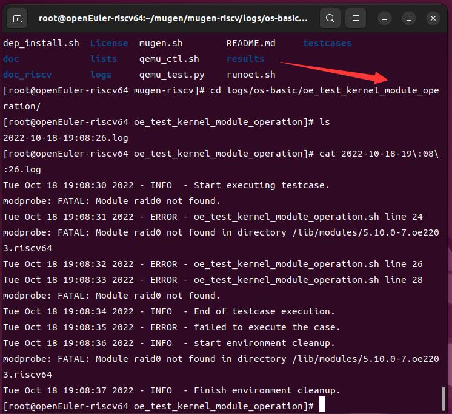

# mugen使用方法_以os-basic测试套为例

- 写在前面：本mugen使用方法以[自动化测试小组仓库readme教程](https://github.com/brsf11/mugen-riscv)和[原有的mugen教程](https://github.com/brsf11/Tarsier-Internship/blob/main/Presentation/RISC-V-oE-Autotest-Dev/Markdown/report.md)为基础，以os-basic测试套为例，加入了比较具体化的步骤以及关键信息截图等内容，可为后续同学入门提供便利，降低配置环境的难度。
- 本使用教程侧重点为较为容易地跑起来第一个程序，并可以与上述两个教程结合使用。

## mugen环境配置教程

#### mugen的使用环境

首先要明确mugen的使用环境。mugen是openEuler社区开放的测试框架，提供公共配置和方法以便社区开发者进行测试代码的编写和执行，因此mugen的环境为被测环境，这里是**openEuler环境**。注意这里不要把环境放到启动qemu的Ubuntu环境下。

#### 克隆我们维护的仓库

使用命令`git clone https://github.com/brsf11/mugen-riscv.git`将我们的仓库clone到openEuler环境下。

#### 安装依赖

进入上一步clone过的仓库，使用`bash dep_install.sh`命令安装依赖

#### 配置测试套环境变量

这里配置时，可能参考[自动化测试小组仓库readme教程](https://github.com/brsf11/mugen-riscv)会有一定迷惑，这是因为该仓库是给出了一种比较通用的模式，来进行环境变量配置，这里可以使用如下一个较为具体的例子进行。

- 具体命令：`bash mugen.sh -c --ip 127.0.0.1 --password openEuler12#$ --user root --port 22`

- 通用命令：`bash mugen.sh -c --ip $ip --password $passwd --user $user --port $port`

这一步完成之后，进入./conf/env.json，就可以看见已经生成的json文件。

#### 用例执行

我们这里是执行os-basic测试套，可以用指定测试套的方案。

- 具体命令：`bash mugen.sh -f os-basic`

- 通用命令： `bash mugen.sh -f testsuite`

当执行这个命令时，可以看到控制台显示如下：

#### 查看日志与简单分析

- 进入logs文件夹os-basic测试套文件夹目录：`cd ./logs/os-basic`文件夹
- 选择一个上一步中返回值不为0（出现错误）的用例，进入文件夹（这里选了kernel_module_operation)
- 查看日志信息：`cat xxxx.log`这里是进行测试的时间，输出的log信息
- 错误分析：可以看到本次我们选择的例子是因为缺少raid0模块导致

## 一些需要注意的点

- 注意mugen使用的环境是openEuler等被测环境，不是启动qemu的Ubuntu等环境
- 对于os-basic测试套，其中用例比较多，总共可能需要数个小时，但是单个测试用例不会超过半小时，否则是卡死了的
- 目前mugen不需要GUI环境，使用ssh命令行连接后就可以